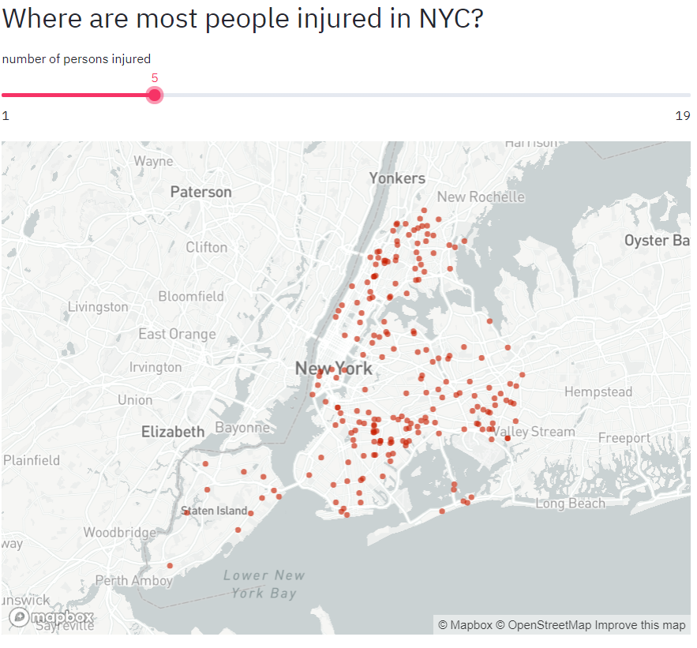
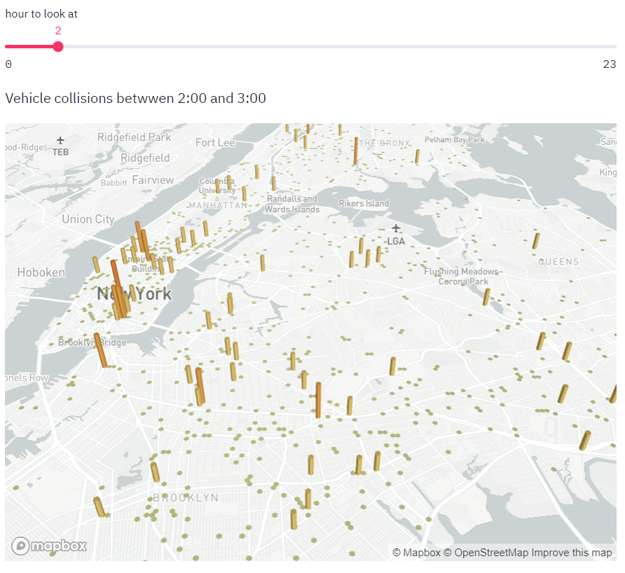
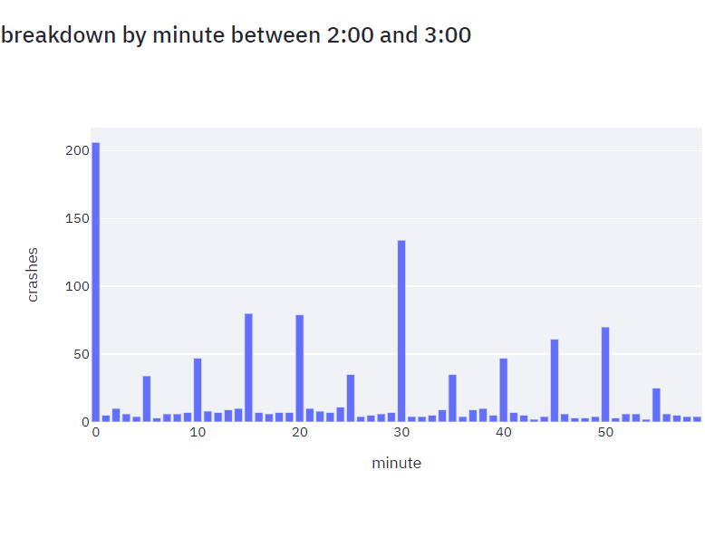
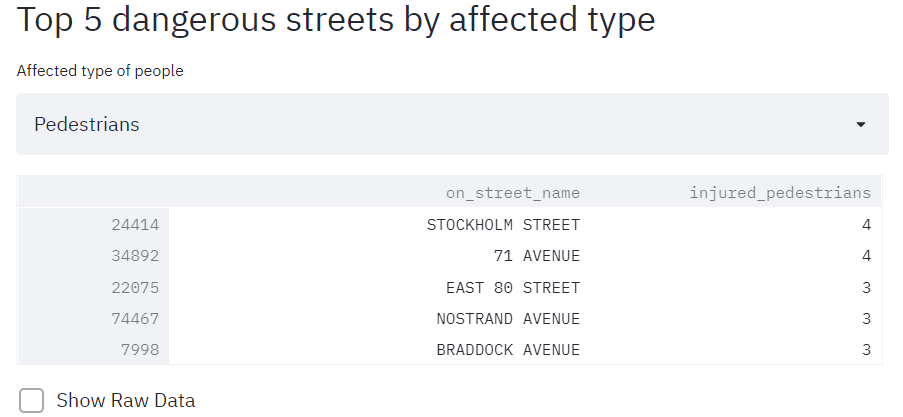
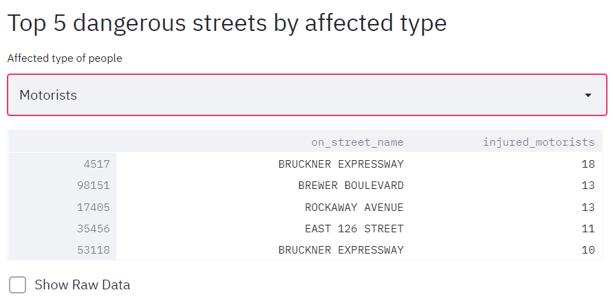
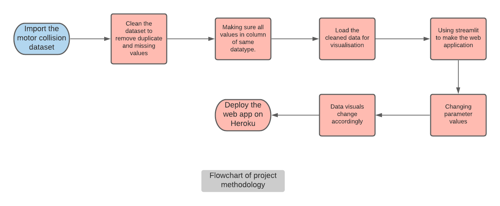

# Data Visualization Using Streamlit
## Streamlit project to visualize the data of motor vehicle collisions in the city of New York

The project is made using streamlit,pandas,pydeck and plotly libraries for web app and visualization.
Visit the website:- https://streamlit-visualize.herokuapp.com/

Dataset used is of motor vehicle collisions in New York city. Source:-https://data.cityofnewyork.us/Public-Safety/Motor-Vehicle-Collisions-Crashes/h9gi-nx95

The website has 4 data visuals:-

First one shows the areas on the map where accidents occur the most. The user can change the slider values which changes the number of person injured which in turn shows the different parts of city where the aforementioned number of people got injured.

Second part shows number of accidents which occur during the mentioned time period. The time period can be changed using the given slider.

Third part is a graph showing the number of accidents between the time period break down by minutes

The last part shows the top 5 dangerous areas for 3 different type people:- Cyclist, Motorist and Padestrians.

## Images of the working project

<table style="width:100%">
  <tr>
    <th></th>
    <th></th>
  </tr>
  <tr>
    <th></th>
    <th></th>
  </tr>
  <tr>
    <th></th>
  </tr>
 </table>
 
 ## Flowchart of methodology
 
